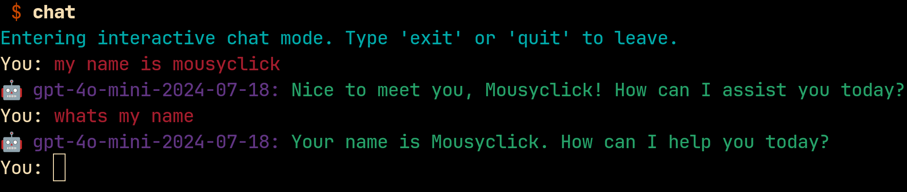
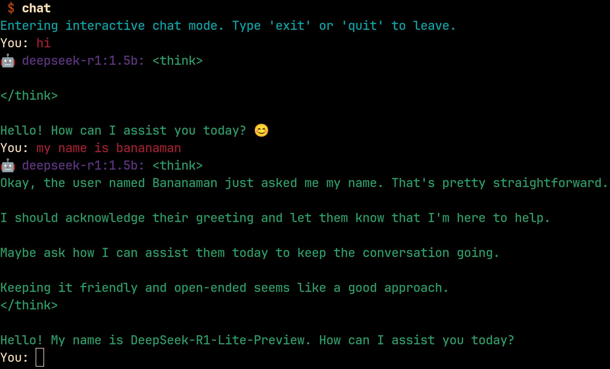

# 🤖 mousyclick's AI shell

> ⚠️ **WORK IN PROGRESS**  
> This project is currently under development and is part of a YouTube tutorial series.  
> [Follow along on YouTube](https://www.youtube.com/playlist?list=PLtoeaLo7A_tJtycgPYlSXTE-pl_OE_pph)

Sample: gpt-4o-mini-2024-07-08


Sample: deepseek-r1:1.5b

 
## Secret configuration .env file

Be sure to add the `.env` to `.gitignore` and never check in this file

```bash
echo .env >> .gitignore
```

Add the following entry to your `.env` file and replace `<OPENAI_API_KEY>` with your secret

```export OPENAI_API_KEY=<OPENAI_API_KEY>```

## Command Reference

On Linux you should `source` the `.env` file before launching the application using:

```bash
source .env
./mvnw spring-boot:run
```

Start Ollama with deepseek model:

```bash
ollama run deepseek-r1:14b
```

### Reference Documentation
For further reference, please consider the following sections:

* [GitHub Repository](https://github.com/mousyclick/aish)
* [The Software Development Kit Manager](https://sdkman.io/)
* [Official Apache Maven documentation](https://maven.apache.org/guides/index.html)
* [Spring Boot Maven Plugin Reference Guide](https://docs.spring.io/spring-boot/3.4.7/maven-plugin)
* [Create an OCI image](https://docs.spring.io/spring-boot/3.4.7/maven-plugin/build-image.html)
* [JetBrains Toolbox App](https://www.jetbrains.com/toolbox-app/)
* [JetBrains EnvFile Plugin](https://plugins.jetbrains.com/plugin/7861-envfile)
* [OpenAI developer platform](https://platform.openai.com/docs/overview)
* [Spring Initializr Project](https://start.spring.io/)
* [Spring Initializr Template (for this project)](https://start.spring.io/#!type=maven-project&language=java&platformVersion=3.4.7&packaging=jar&jvmVersion=24&groupId=mousyclick&artifactId=aish&name=aish&description=AI%20Spring%20Application&packageName=mousyclick.aish&dependencies=spring-shell,spring-ai-openai)
* [Spring AI API](https://docs.spring.io/spring-ai/reference/api)
* [Spring Shell](https://docs.spring.io/spring-shell/reference/index.html)
* [OpenAI](https://docs.spring.io/spring-ai/reference/api/chat/openai-chat.html)
* [Ollama](https://ollama.com/)

### TODO

* start up with deepseek-r1:14b
  * `watch -n 1 nvidia-smi`
* 